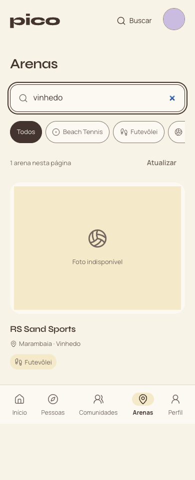
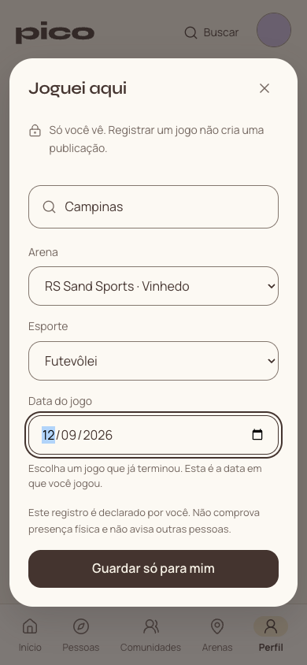
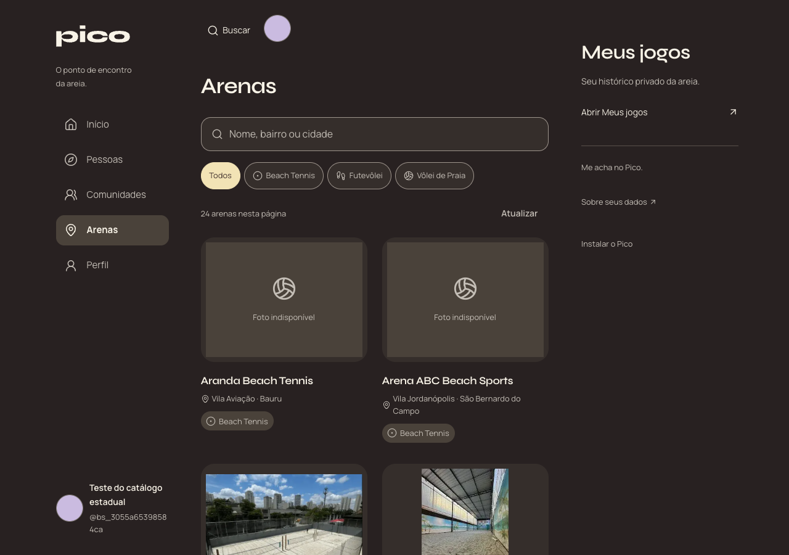

# Validação e operação — catálogo estadual

13/09/2026, horário de São Paulo. Lote de 43 novas arenas: catálogo com 60 unidades em 25 municípios. Pesquisa pública parcial, sem alegação de inventário completo do Google; [fontes, divergências e lacunas](lote-publicado.md).

## Evidências

- Lint, typecheck, 132 testes locais e build conectado aprovados. Testes PGlite exercitam busca antes da paginação, acentos, caracteres literais, esporte, limites, arenas ocultas/arquivadas e contas não admitidas. O importador preserva histórico/edições e é idempotente.
- 50 verificações hospedadas com Auth, API, RPC, Storage e Chrome no app compilado conectado ao desenvolvimento. Conta temporária, avatar e jogo privado removidos ao terminar. [Resultado](hosted.json). Não foram criadas contas nem conteúdo de teste em produção.
- As três páginas contêm 24/24/12 arenas, sem duplicatas. Busca por Vinhedo alcança RS Sand Sports fora da primeira página; busca sem acentos encontra Ribeirão Preto. Trocar a pesquisa reinicia a paginação.
- Jogos e local de publicação alcançam o catálogo inteiro. Pesquisar Campinas preserva RS Sand Sports quando já escolhida. O registro é salvo em Meus jogos, sem gerar publicação automática. Leitura sem login retorna 401; erros não viram demo nem resultado vazio.
- Revisão representativa em 390px/claro e 1280px/escuro: cidade legível, ausência de overflow horizontal, foto indisponível explícita e imagens anteriores preservadas. Nenhum erro de execução no navegador; sem teste em aparelho físico.

Integração com a main `d112b76` preserva a rota de saúde e sua documentação. Conflitos restritos aos registros de plano, revisão e changelog foram resolvidos mantendo ambas as entregas; lint/typecheck/build e os 132 testes passaram na versão integrada.

## Aplicação no banco

Migration aditiva `20260913230000_arena_directory_search.sql` aplicada primeiro no desenvolvimento, depois no principal; tipos gerados do desenvolvimento. RPC `search_arenas` usa SECURITY INVOKER, admissão vigente e RLS. Não altera grants de leitura das tabelas, papéis, Auth, audiências ou regras dos jogos.

Importação transacional pelo script existente, sem seed ou reset. SHA-256 do SQL: `010386937f3e24cfd30f97ac28ddd76e3507a122b88a4324ecf9cbfcfa2704d5`. Nos dois ambientes, 60 identidades do manifesto presentes. Principal conferido antes/depois: 17 → 60 arenas públicas ativas, 1 → 25 cidades. Todas as linhas anteriores de arenas e modalidades continuaram idênticas, inclusive gestão/status/versão/imagens.

Inventários privados da migration e da importação: 15 registros de conteúdo antes/depois; zero removidos, identidades alteradas ou edições. Nenhuma das 76 fotos anteriores mudou. Recibos completos ficam fora do Git, em `.vercel/content-preservation` e `.vercel/arena-research`, para não expor conteúdo dos jogadores.

## Publicação e retorno

Release autorizado via commit, PR com CI obrigatória e merge na main. Publicar pelo `scripts/deploy.mjs`, projeto `pico-app`, destino `pico-app-sepia.vercel.app`, conferindo `/api/version`, acesso anônimo negado e preservação de conteúdo depois do deploy. SHA, resultado da CI e URL do artefato ficam no PR e no recibo operacional; este documento não antecipa a confirmação do deploy.

Retorno se o artefato falhar: promover a versão anterior `9372a51648ae174f56c9fc0b5b68e1e6ee49880f`. Migration e catálogo são aditivos e compatíveis com o leitor anterior. Não apagar arenas importadas nem restaurar dados sobre edições dos jogadores; a versão anterior mantém paginação, mas sua busca se limita à página carregada. Em caso de falha de preservação, interromper publicação e investigar os recibos privados.

## Capturas

Contas e avatar controlados de desenvolvimento, não jogadores reais.

