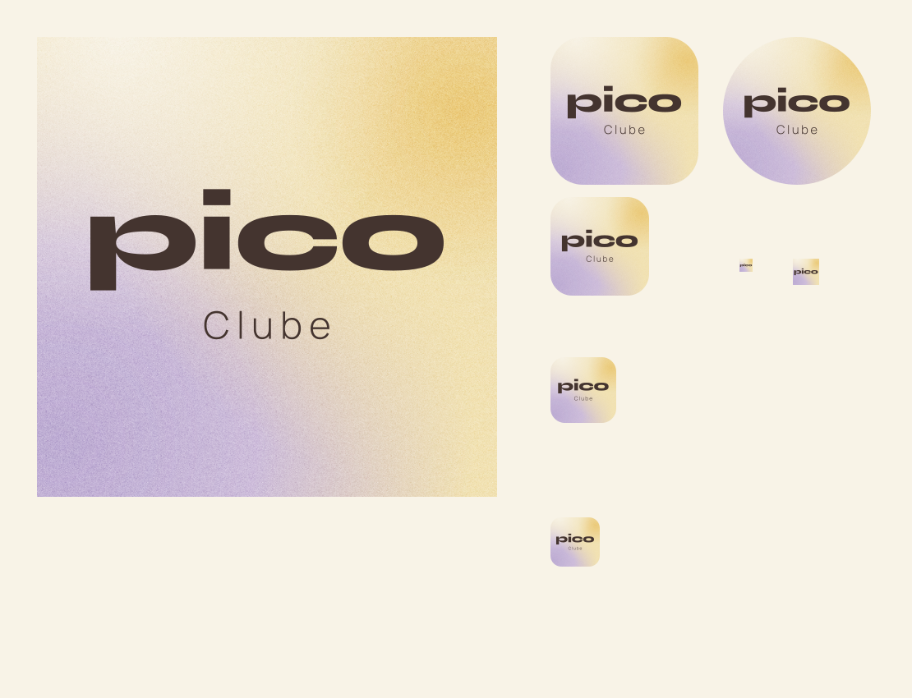

# Pico Club: ícone do aplicativo

Decisão do responsável em 13/09/2026: substituir o P com ponto por **Pico** em destaque, na forma original, com **Clube** leve abaixo e fundo granulado. O nome de instalação é **Pico Club**; a palavra na arte segue a grafia “Clube” pedida. Esta aplicação substitui o monograma nos ícones do app. O cabeçalho mantém Pico.



## Composição

- Wordmark: contornos exatos de `../logo/wordmark-cacau.svg`, sem alteração de proporção, letras ou espaçamento.
- Linha secundária: Manrope 300, convertida em contornos. Cacau nas duas linhas, sem textura por cima do texto.
- Fundo: campos Manteiga/Lavanda com passagem suave e grão neutro. Fundo completamente opaco. Cantos e círculo são aplicados pelo sistema, não gravados nos arquivos de instalação.
- Maskable: wordmark de 730 unidades na tela de 1024, dentro do círculo seguro central de raio 409,6. A linha Clube também fica dentro dessa área.
- Favicon: wordmark Pico sozinho em 16, 32 e 48px, pois a linha Clube ficaria ilegível nessa redução.

## Arquivos

`icon.svg` e `maskable.svg` são os mestres com fundo incorporado e texto vetorial; `icon-1024.png` é a capa de alta resolução. `background.png` e `grain.png` guardam o fundo. `preview.png` mostra a capa, os recortes de sistema e reduções. `exports.json` registra dimensões e opacidade das exportações.

O app usa `/icons/pico-club-192.png`, `/icons/pico-club-512.png` e `/icons/pico-club-maskable-512.png`. Os caminhos públicos antigos recebem a mesma arte para consumidores existentes. `src/app/apple-icon.png`, `src/app/icon.svg` e `src/app/favicon.ico` atendem as convenções do Next.js.

Reprodução no projeto:

```sh
node scripts/render-pico-club-icon.mjs
```

Composição nativa com o logo e a fonte existentes; nenhuma fotografia, nova fonte ou dependência do app foi adicionada. A semente fixa torna o grão reproduzível.

## Instalação e atualização

O manifesto mantém `id: /`, `scope: /`, `start_url: /feed` e modo standalone. Nome e arquivos de ícone mudam sem recriar o aplicativo ou alterar a sessão. Desenvolvimento mantém um nome distinto.

O navegador decide quando atualizar o ícone de uma instalação existente. No iPhone, uma capa já adicionada à tela inicial pode permanecer antiga mesmo depois do deploy. Não limpar armazenamento nem solicitar logout para trocar a imagem. Instalação e atualização em aparelho físico não foram comprovadas por esta revisão local.
