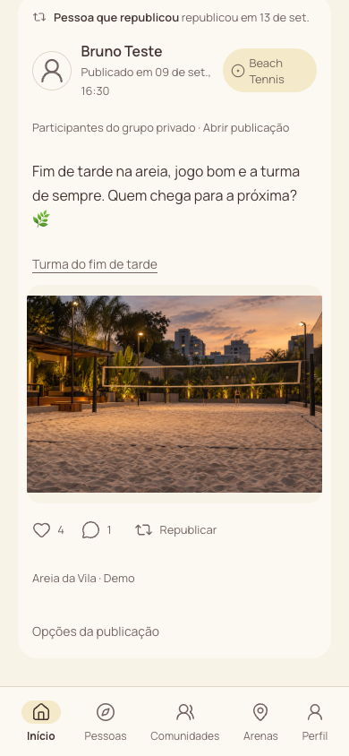
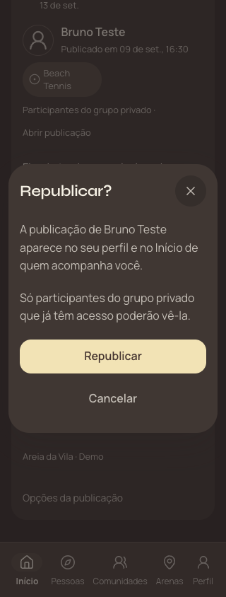

# Republicações — evidências

Implementação sobre Aura Manteiga, 13/09/2026. [Contrato](../REPOSTS.md).

- Lint, typecheck, builds conectado/demo e 93 testes locais aprovados.
- [Supabase de desenvolvimento](hosted.json): 112 verificações com Auth real, Data API, RPC e Next HTTP. Quatro identidades controladas criadas e removidas; nenhum teste escreveu no principal.
- [Navegador conectado](browser.json): cancelar, foco, erro controlado, clique duplo, recarga, perfil, entrega a seguidor, audiência privada e desfazer. Três layouts e nenhum erro de JavaScript. Teste usa o app compilado e as contas controladas.
- [Revisão final de estilo](styles.json): quatro layouts, 320/390/1280px, claro/escuro e texto a 200%, com dados locais identificados neste relatório como fixtures. Corrigidos cabeçalho, compositor, título e botões. Não há escrita remota nessa conferência.
- [Demo no navegador](demo.json): republicar, ver no perfil, desfazer e ausência de envios externos. Testes unitários também cobrem referência canônica, acesso privado e direção do vínculo.

Capturas usam pessoas e conteúdo controlados/ilustrativos. Emulação não comprova instalação, câmera/teclado ou safe areas em aparelho físico. Não foi realizada medição de carga real, nova configuração de SMTP ou pesquisa com jogadores.

Release usa PR/CI/main, backup cifrado e conferência de dados antes/depois da migration. Recibo `.vercel/reposts-release.json` liga PR, commit, artefato, versão pública e rollback Aura `308b86b16109`; `/api/version` confirma a revisão servida. O leitor anterior continua disponível.
