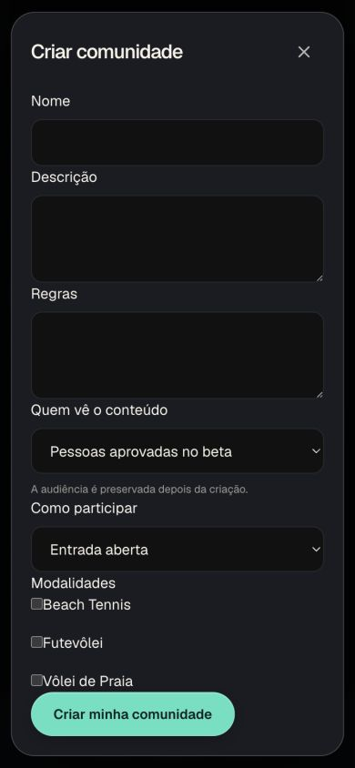
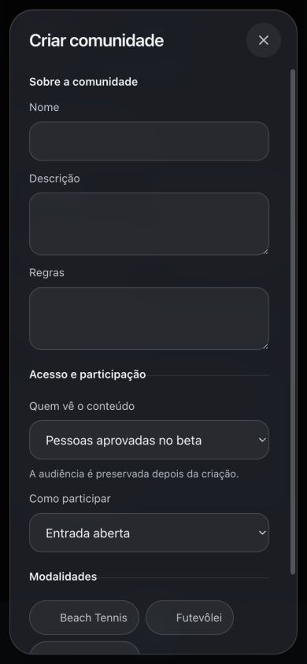
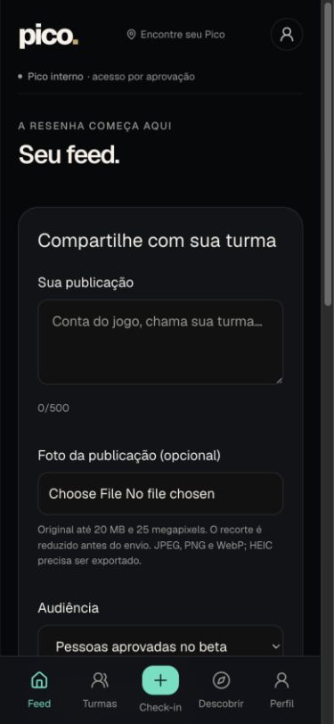
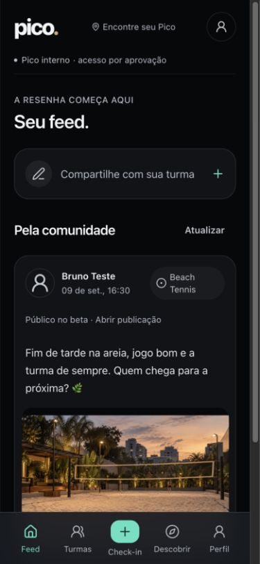

# Revisão visual do Pico — setembro de 2026

Refino do app existente, iniciado em `8e1e6b86ec5e` e atualizado sobre a main `5a5186bcba61`. O perfil e o suporte HEIC do Ciclo 10 chegaram durante a rodada e foram preservados. As comparações de perfil incluem essa evolução anterior, além da harmonização de estilos desta revisão.

## Antes e depois

Capturas reais do navegador, sem edição de imagem, na viewport **390 × 844 CSS px**. A scrollbar pode ocupar parte da largura capturada. Desktop: **1280 × 900**. O conteúdo é uma fixture local identificável, igual nos pares; fotos são arquivos já existentes no Pico. As capturas mostram a área visível, não uma montagem da página inteira.

| Tela | Antes | Depois |
| --- | --- | --- |
| Criar comunidade |  |  |
| Feed |  |  |
| Perfil | [Antes](before/profile-390.png) | [Depois](after/profile-390.png) |
| Editar perfil | [Antes](before/profile-edit-390.png) | [Depois](after/profile-edit-390.png) |
| Comunidades | [Antes](before/communities-390.png) | [Depois](after/communities-390.png) |
| Arenas | [Antes](before/arenas-390.png) | [Depois](after/arenas-390.png) |
| Descoberta | [Antes](before/discover-390.png) | [Depois](after/discover-390.png) |
| Login | [Antes](before/login-390.png) | [Depois](after/login-390.png) |
| Check-in | [Antes](before/checkin-390.png) | [Depois](after/checkin-390.png) |
| Feed desktop | [Antes](before/feed-1280.png) | [Depois](after/feed-1280.png) |

Estados adicionais: [seleção múltipla](after/community-selection-390.png), [erro preservando campos](after/community-error-390.png), [ação em viewport de altura reduzida](after/community-short-height.png), [publicação confirmada](after/publication-success-390.png), [vazio](after/feed-empty-390.png), [erro de leitura](after/feed-error-390.png) e [carregamento](after/arenas-loading-390.png).

## Cobertura

| Área | Aplicação do padrão e inspeção |
| --- | --- |
| Acesso | Login, cadastro, recuperação, redefinição, admissão, confirmação inválida e convites sem token. Fonte e controles compartilhados; nenhum formulário de Auth enviado. |
| Feed/publicações | Leitura, foto, opções e comentários existentes; acionador compacto abre os mesmos campos, audiências e destinos em diálogo. Publicação individual também revisada. |
| Perfil | Perfil próprio e alheio, abas e editor; foto/HEIC do Ciclo 10 preservados. O onboarding usa o editor compartilhado; não foi realizado novo cadastro remoto. |
| Comunidades | Busca/lista, detalhe, criação, edição, modalidades, participação, fotos, convites e vínculo de arena. Gestão e opções mantidas. |
| Arenas | Catálogo, busca/filtros, detalhe, gestão e solicitação de cadastro/correção existentes. |
| Demais | Check-in/histórico, descoberta, conta, administração, instalação e privacidade. `/` continua encaminhando ao feed. |

Dez telas (`feed`, `perfil`, `comunidades`, `arenas`, `descobrir`, `checkin`, `conta`, `admin`, `login`, `signup`) foram medidas em **320, 390, 430, 768 e 1280 px**, totalizando **50 casos sem overflow horizontal**. [Medições](responsive.json). Quinze rotas auxiliares e detalhes foram inspecionados em 390 px: [registro](route-coverage.json). Filtros que já usam rolagem horizontal mantêm esse comportamento dentro de seu próprio contêiner.

## Validação

- `npm run lint`, `npm run typecheck`, **76 testes** de `npm test` e build de produção aprovados. O build local usou `PICO_BUILD_DIR=.next-visual-check` para preservar o servidor de desenvolvimento existente.
- Quatro envios feitos pela UI exclusivamente à fixture: criação de comunidade com duas modalidades, edição para três, publicação com arena e comunidade e edição de perfil. **Dez asserções** dos payloads passaram. [Evidência](interaction-results.json).
- Falha 503 mantém dados e seleções; audiência continua desabilitada após criação. Salvar só confirma depois da resposta. Nenhuma conta ou publicação real foi alterada.
- Escape fecha apenas o recorte superior; foco retorna ao arquivo e depois ao acionador da publicação. Rascunho sobrevive a fechar/reabrir. Tab/Shift+Tab permanecem no diálogo. Cancelamento de perfil preserva o rascunho quando solicitado; setas navegam pelas abas.
- Em 390 × 430, o diálogo mede 406 px; o fechamento permanece acessível e Tab alcança a ação principal sem sobreposição. Isso é teste de altura reduzida, não prova de teclado virtual em aparelho físico.
- Contraste calculado por luminância relativa: texto principal/carvão **16,74:1**, texto secundário/vidro sobre branco **6,58:1**, texto discreto/campo em foco no pior caso avaliado **4,67:1**, acento/vidro **6,92:1**, texto/botão principal **10,22:1**. O cálculo usa vidro a 88%, mais transparente que o diálogo a 92%. [Valores](contrast.json). Não equivale a certificação WCAG integral.
- `tests/browser-profile.mjs`, executado pelo workflow existente, foi ampliado para texto a 200%, movimento reduzido e diálogos aninhados, além das verificações de perfil e HEIC real já existentes. Seu resultado remoto deve estar verde antes da integração.

## Reprodução e limites

`tests/helpers/visual-preview.mjs` serve páginas e assets do build real através de loopback e intercepta todas as APIs. Não faz parte do app publicado. Com o Next já iniciado em uma porta local, execute `node tests/helpers/visual-preview.mjs 3004 <versão-do-build>` e abra `http://127.0.0.1:3002`. O terceiro argumento evita um aviso artificial de atualização. Os dados somem ao parar o processo. `/__visual` mostra os envios locais; `/__visual/mode?value=empty|error|slow|success` permite reproduzir estados. Não use credenciais reais nessa prévia: a fixture intercepta rotas `/api`, não o SDK de autenticação.

Não houve alteração de banco, migrations, RLS, Storage, Auth, credenciais, domínios ou configuração de serviços. Não se afirma nova validação de persistência/Supabase remoto nesta rodada visual. Instalação PWA, VoiceOver, teclado virtual, zoom e gestos em aparelhos físicos continuam sem teste físico. O fallback sem blur foi implementado em CSS; a inspeção principal usou o navegador com blur disponível.

Prints originais do Yankee e do formulário não estavam anexados; a limitação e as referências públicas observadas estão no [design system](../pico-design-system.md). O envio usa a branch de transporte **já existente** `unify-primary` e PR para `main`, com checks exigidos, sem criar branch ou aplicar force push. A versão pública é verificável em [api/version](https://pico-app-sepia.vercel.app/api/version); screenshots locais não são prova de deploy.
